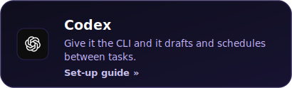
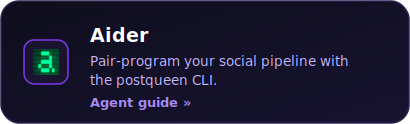
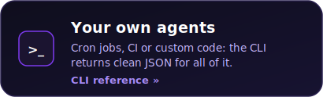
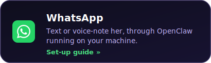
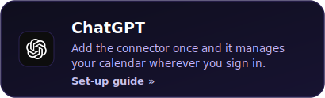
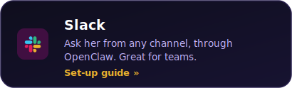
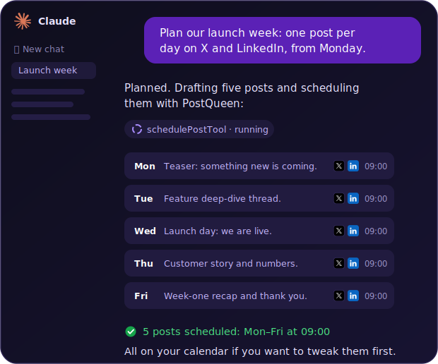
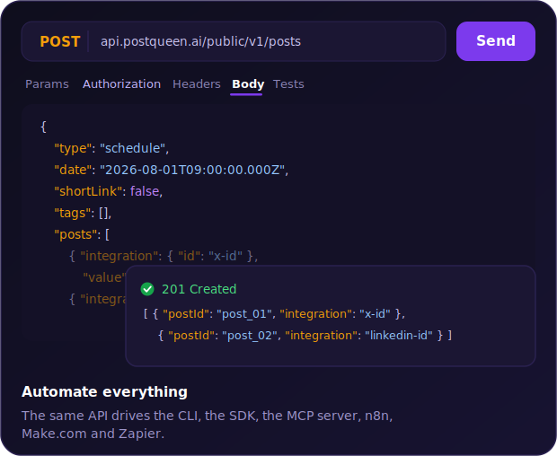

<p align="center">
  <a href="https://postqueen.ai">
    
  </a>
</p>

<h3 align="center">
  <a href="https://postqueen.ai/agent">🆕 NEW: meet the PostQueen Agent, run your social media from Claude Code, ChatGPT, OpenClaw or Hermes »</a>
</h3>

<br/>

<p align="center">
  <strong>Stop doing social media yourself.</strong>
</p>

<p align="center">
  PostQueen is an AI employee for your social media. Tell her what to share, in one sentence. She writes the copy, designs the visual and schedules it on every channel you have. You just review the calendar.
</p>

<p align="center">
  <strong><a href="https://postqueen.ai">PostQueen</a></strong> is the open-source alternative to <strong>Buffer, Hootsuite, Sprout Social</strong> and <strong>Later</strong>.
</p>

<br/>

<p align="center"></p>

<br/>

<p align="center">
  <a href="https://postqueen.ai">Website</a> &nbsp;·&nbsp;
  <a href="https://postqueen.ai/pricing">Pricing</a> &nbsp;·&nbsp;
  <a href="https://docs.postqueen.ai">Docs</a> &nbsp;·&nbsp;
  <a href="https://api.postqueen.ai/docs">API Reference</a> &nbsp;·&nbsp;
  <a href="https://postqueen.ai/agent">Agents</a> &nbsp;·&nbsp;
  <a href="https://postqueen.ai/mcp">MCP</a> &nbsp;·&nbsp;
  <a href="https://www.npmjs.com/package/postqueen">CLI</a>
</p>

<p align="center">
  <a href="https://www.npmjs.com/package/postqueen"></a>
  <a href="https://www.npmjs.com/package/postqueen"></a>
  <a href="https://github.com/GkhanKINAY/postqueen-agent/blob/main/LICENSE"></a>
  <a href="https://nodejs.org"></a>
</p>

<br/>

<p align="center">
  <!-- CHANNEL ICONS: 30 individual imgs, natural flow, mobile-wrap -->
                               
</p>


<br/>

<p align="center"></p>

<br/>

<h3 align="center">Schedule and generate posts with AI</h3>

<p align="center">
  
</p>

<br/>

<p align="center">
  <strong>Free for 7 days in the cloud. Forever free on your own server.</strong>
</p>

<p align="center">
  <a href="https://postqueen.ai"></a>
  &nbsp;&nbsp;
  <a href="https://github.com/GkhanKINAY/postqueen-docker-compose"></a>
</p>

<br/>

---

## 💬 Just talk to her

Message her like a colleague from wherever you already type or talk: WhatsApp or Telegram, the Claude app on your phone, your terminal through Claude Code, ChatGPT through MCP. Say what you want posted, and consider it handled.

<p align="center">
            
</p>

<p align="center">
  
</p>

That first message is a voice note, and that is the point: if your assistant supports voice, you can say it out loud. Voice note in, posts out.

Try saying:

> *"Plan a month of content for our coffee shop and fill the calendar."*

> *"Take this photo of today's special and put it on Instagram at lunchtime."*

> *"We just hit 10k followers, write a warm thank-you post for all our channels."*

> *"Turn my latest YouTube video into posts for X, LinkedIn and Threads."*

**You get the final word.** Everything lands on your calendar first: read it, tweak it, or delete it before it goes out. Prefer to approve every post? Ask for drafts, and nothing publishes until you schedule it yourself.

<br/>

<p align="center"></p>

<br/>

## ⚡ Quickstart

Install the skill, set your key, post. That is the whole loop:

```bash
# Install the skill
npx skills add GkhanKINAY/postqueen-agent

# Set your API key
export POSTQUEEN_API_KEY=your_api_key

# List your connected platforms
postqueen integrations:list

# Create your first post
postqueen posts:create \
  -c "Hello from PostQueen!" \
  -s "2026-08-01T09:00:00Z" \
  -i "your-integration-id"
```

Every command reads flags and prints JSON, so any assistant that can run shell commands can now run your social media.

<p align="center">
  
</p>

<br/>

Pick your agent — each card opens its guide:

<a href="https://postqueen.ai/claude-code"></a> <a href="https://postqueen.ai/codex"></a> <a href="https://postqueen.ai/cursor"></a> <a href="https://postqueen.ai/agent"></a> <a href="https://postqueen.ai/hermes-agent"></a> <a href="https://postqueen.ai/agent"></a> <a href="https://postqueen.ai/agent"></a> <a href="https://postqueen.ai/agent"></a> <a href="https://postqueen.ai/agent"></a> <a href="https://github.com/GkhanKINAY/postqueen-agent"></a>

<br/>

<p align="center"></p>

<br/>

## 📱 From your phone

There is no PostQueen app to install, and that is the point: whichever assistant you already carry in your pocket becomes her phone number. Message it there, and it manages your whole PostQueen calendar — drafting, scheduling and publishing from inside the chat.

<p align="center">
  
</p>

Pick your app — every card is a click away from its two-minute set-up guide:

<a href="https://postqueen.ai/openclaw"></a> <a href="https://postqueen.ai/openclaw"></a> <a href="https://postqueen.ai/mcp"></a> <a href="https://postqueen.ai/chatgpt"></a> <a href="https://postqueen.ai/openclaw"></a> <a href="https://postqueen.ai/openclaw"></a>

<br/>

<p align="center"></p>

<br/>

## 🦞 Meet her open agents: OpenClaw &amp; Hermes

The two open-source agents everyone is running right now both speak PostQueen natively. **OpenClaw** lives on your machine and answers you from any chat app. **Hermes** does that too — and give it one brief, it plans your whole week on its own. Both drive the same `postqueen` CLI.

<p align="center">
  
</p>

<a href="https://postqueen.ai/openclaw"></a> <a href="https://postqueen.ai/hermes-agent"></a>

**Any other agent works too** — anything that can run a CLI command or call MCP can run your socials. [Agent guide »](https://postqueen.ai/agent)

<br/>

<p align="center"></p>

<br/>

## 🔑 Get your API key

You need an API key for the CLI, the skill and the MCP server. It takes a minute:

1. Open **[app.postqueen.ai/settings](https://app.postqueen.ai/settings)** (or your own self-hosted instance).
2. Go to **Developers → Public API**.
3. Click **Reveal** to show your key.
4. Copy it and set it in your shell:

```bash
export POSTQUEEN_API_KEY="your_api_key"
```

Keep it secret: it grants full access to your account. You can revoke or rotate it any time from the same screen.

---

## 🔌 Or connect over MCP

Prefer tool calls over shell commands? PostQueen ships a hosted MCP server with **10 tools**, so any MCP client can list channels, upload media and schedule posts without installing anything.

**One line (Claude Code or any CLI client):**

```bash
claude mcp add --transport http postqueen https://api.postqueen.ai/mcp/<YOUR_API_KEY>
```

**Config-file clients (Claude Desktop, Cursor, and others):**

```json
{
  "mcpServers": {
    "postqueen": {
      "url": "https://api.postqueen.ai/mcp/<YOUR_API_KEY>"
    }
  }
}
```

Full guides: [postqueen.ai/mcp](https://postqueen.ai/mcp) and [docs.postqueen.ai/mcp/setup](https://docs.postqueen.ai/mcp/setup).

---

##  From ChatGPT

One link, no install. Add PostQueen as a connector and ask ChatGPT to draft and schedule your week:

<p align="center">
  
</p>

```text
Settings → Connectors → add:  https://api.postqueen.ai/mcp/<YOUR_API_KEY>
```

Set-up guide: [ChatGPT »](https://postqueen.ai/chatgpt)

<br/>

<p align="center"></p>

<br/>

##  From Claude

The same one-link connector works on claude.ai — and it follows you into the Claude apps on iOS, Android and desktop. Ask Claude to plan and schedule your week:

<p align="center">
  
</p>

```text
claude.ai → Settings → Connectors → add:  https://api.postqueen.ai/mcp/<YOUR_API_KEY>
```

Set-up guide: [Claude »](https://postqueen.ai/mcp)

<br/>

<p align="center"></p>

<br/>

## Installation

### From npm (Recommended)

```bash
npm install -g postqueen
# or
pnpm install -g postqueen
```

### Install as a skill

Register the CLI as a skill for coding agents that support the `skills` registry:

```bash
npx skills add GkhanKINAY/postqueen-agent
```

> Published on npm as [`postqueen`](https://www.npmjs.com/package/postqueen). By default the CLI talks to the hosted PostQueen API at `https://api.postqueen.ai`. Set the `POSTQUEEN_API_URL` environment variable to target any self-hosted PostQueen instance. The only URL-related flag is `--auth-server` (on `auth:login`), which points the OAuth2 device flow at a self-hosted auth server.

---

## Authentication

### Option 1: API Key (quickest)

Grab your key at **[app.postqueen.ai/settings](https://app.postqueen.ai/settings)** (Developers → Public API → Reveal), then export it:

```bash
export POSTQUEEN_API_KEY=your_api_key_here
```

**Optional:** Custom API endpoint

```bash
export POSTQUEEN_API_URL=https://your-custom-api.com
```

### Option 2: OAuth2 device flow

Authenticate using the device flow: no client ID or secret needed:

```bash
postqueen auth:login
```

This will:
1. Display a one-time code in your terminal
2. Open your browser to authorize
3. Automatically save credentials to `~/.postqueen/credentials.json`

```bash
# Check current auth status (verifies credentials are still valid)
postqueen auth:status

# Remove stored credentials
postqueen auth:logout
```

The device flow needs an auth server. By default it points at `cli-auth.postqueen.ai`; you can run your own with the guide in [`server/SERVER.md`](./server/SERVER.md) and point the CLI at it via `POSTQUEEN_AUTH_SERVER`. If the auth server is unreachable, use an API key instead — every command works the same either way.

> **Note:** OAuth2 credentials take priority over the API key when both are present.

---

## Commands

### Discovery & Settings

**List all connected integrations**
```bash
postqueen integrations:list
postqueen integrations:list --group "customer-id"
```

Returns integration IDs, provider names, and metadata. Use `--group` to return only the channels assigned to a specific group (customer).

**List all groups (customers)**
```bash
postqueen integrations:groups
```

Returns all groups (customers) for your organization as `{id, name}`. Use a group's `id` with `integrations:list --group` to filter channels.

**Get integration settings schema**
```bash
postqueen integrations:settings <integration-id>
```

Returns character limits, required settings, and available tools for fetching dynamic data.

**Trigger integration tools**
```bash
postqueen integrations:trigger <integration-id> <method-name>
postqueen integrations:trigger <integration-id> <method-name> -d '{"key":"value"}'
```

Fetch dynamic data like Reddit flairs, YouTube playlists, LinkedIn companies, etc.

**Examples:**
```bash
# Get Reddit flairs
postqueen integrations:trigger reddit-123 getFlairs -d '{"subreddit":"programming"}'

# Get YouTube playlists
postqueen integrations:trigger youtube-456 getPlaylists

# Get LinkedIn companies
postqueen integrations:trigger linkedin-789 getCompanies
```

---

### Creating Posts

**Simple scheduled post**
```bash
postqueen posts:create -c "Content" -s "2026-12-31T12:00:00Z" -i "integration-id"
```

**Draft post**
```bash
postqueen posts:create -c "Content" -s "2026-12-31T12:00:00Z" -t draft -i "integration-id"
```

**Post with media**
```bash
postqueen posts:create -c "Content" -m "img1.jpg,img2.jpg" -s "2026-12-31T12:00:00Z" -i "integration-id"
```

**Post with comments** (each comment can have its own media)
```bash
postqueen posts:create \
  -c "Main post" -m "main.jpg" \
  -c "First comment" -m "comment1.jpg" \
  -c "Second comment" -m "comment2.jpg,comment3.jpg" \
  -s "2026-12-31T12:00:00Z" \
  -i "integration-id"
```

**Multi-platform post**
```bash
postqueen posts:create -c "Content" -s "2026-12-31T12:00:00Z" -i "twitter-id,linkedin-id,facebook-id"
```

**Platform-specific settings**
```bash
postqueen posts:create \
  -c "Content" \
  -s "2026-12-31T12:00:00Z" \
  --settings '{"subreddit":[{"value":{"subreddit":"programming","title":"Post Title","type":"text"}}]}' \
  -i "reddit-id"
```

**Complex post from JSON file**
```bash
postqueen posts:create --json post.json
```

**Options:**
- `-c, --content`: Post/comment content (use multiple times for posts with comments)
- `-s, --date`: Schedule date in ISO 8601 format (REQUIRED)
- `-t, --type`: Post type: "schedule" or "draft" (default: "schedule")
- `-m, --media`: Comma-separated media URLs for corresponding `-c`
- `-i, --integrations`: Comma-separated integration IDs (required)
- `-d, --delay`: Delay between comments in minutes (default: 0)
- `--settings`: Platform-specific settings as JSON string
- `-j, --json`: Path to JSON file with full post structure
- `--shortLink`: Use short links (default: true)

---

### Managing Posts

**List posts**
```bash
postqueen posts:list
postqueen posts:list --startDate "2026-01-01T00:00:00Z" --endDate "2026-12-31T23:59:59Z"
postqueen posts:list --customer "customer-id"
```

Defaults to last 30 days to next 30 days if dates not specified.

**Delete post**
```bash
postqueen posts:delete <post-id>
```

**Change post status (draft ↔ schedule)**
```bash
postqueen posts:status <post-id> --status draft
postqueen posts:status <post-id> --status schedule
```

Move a scheduled post back to a draft, or promote a draft into the publishing queue. Switching to `draft` also terminates any workflow that's already running for the post, so it won't publish. Switching to `schedule` queues the post for publishing at its stored date.

---

### Analytics

**Get platform analytics**
```bash
postqueen analytics:platform <integration-id>
postqueen analytics:platform <integration-id> -d 30
```

Returns metrics like followers, impressions, and engagement over time for a specific integration/channel. The `-d` flag specifies the number of days to look back (default: 7).

**Get post analytics**
```bash
postqueen analytics:post <post-id>
postqueen analytics:post <post-id> -d 30
```

Returns metrics like likes, comments, shares, and impressions for a specific published post.

**⚠️ If `analytics:post` returns `{"missing": true}`**, the post was published but the platform didn't return a usable post ID. You must resolve this before analytics will work:

```bash
# 1. List available content from the provider
postqueen posts:missing <post-id>

# 2. Connect the correct content to the post
postqueen posts:connect <post-id> --release-id "7321456789012345678"

# 3. Analytics will now work
postqueen analytics:post <post-id>
```

---

### Connecting Missing Posts

Some platforms (e.g. TikTok) don't return a post ID immediately after publishing. The post's `releaseId` is set to `"missing"` and analytics won't work until resolved.

**List available content from the provider**
```bash
postqueen posts:missing <post-id>
```

Returns an array of `{id, url}` items representing recent content from the provider. Returns an empty array if the provider doesn't support this feature.

**Connect a post to its published content**
```bash
postqueen posts:connect <post-id> --release-id "<content-id>"
```

---

### Media Upload

**Upload file and get URL**
```bash
postqueen upload <file-path>
```

**⚠️ IMPORTANT: Upload Files Before Posting**

You **must** upload media files to PostQueen before using them in posts. Many platforms (especially TikTok, Instagram, and YouTube) require verified/trusted URLs and will reject external links.

**Workflow:**
1. Upload your file using `postqueen upload`
2. Extract the returned URL
3. Use that URL in your post's `-m` parameter

**Supported formats:**
- **Images:** PNG, JPG, JPEG, GIF
- **Videos:** MP4

**Example:**
```bash
# 1. Upload the file first
RESULT=$(postqueen upload video.mp4)
FILE_PATH=$(echo "$RESULT" | jq -r '.path')

# 2. Use the PostQueen URL in your post
postqueen posts:create -c "Check out my video!" -s "2026-12-31T12:00:00Z" -m "$FILE_PATH" -i "tiktok-id"
```

**Why this is required:**
- **TikTok, Instagram, YouTube** only accept URLs from trusted domains
- **Security:** Platforms verify media sources to prevent abuse
- **Reliability:** PostQueen ensures your media is always accessible

---

## Platform-specific features

### Reddit
```bash
# Get available flairs
postqueen integrations:trigger reddit-id getFlairs -d '{"subreddit":"programming"}'

# Post with subreddit and flair
postqueen posts:create \
  -c "Content" \
  -s "2026-12-31T12:00:00Z" \
  --settings '{"subreddit":[{"value":{"subreddit":"programming","title":"My Post","type":"text","is_flair_required":true,"flair":{"id":"flair-123","name":"Discussion"}}}]}' \
  -i "reddit-id"
```

### YouTube
```bash
# Get playlists
postqueen integrations:trigger youtube-id getPlaylists

# Upload video FIRST (required!)
VIDEO=$(postqueen upload video.mp4)
VIDEO_URL=$(echo "$VIDEO" | jq -r '.path')

# Post with uploaded video URL
postqueen posts:create \
  -c "Video description" \
  -s "2026-12-31T12:00:00Z" \
  --settings '{"title":"Video Title","type":"public","tags":[{"value":"tech","label":"Tech"}],"playlistId":"playlist-id"}' \
  -m "$VIDEO_URL" \
  -i "youtube-id"
```

### TikTok
```bash
# Upload video FIRST (TikTok only accepts verified URLs!)
VIDEO=$(postqueen upload video.mp4)
VIDEO_URL=$(echo "$VIDEO" | jq -r '.path')

# Post with uploaded video URL
postqueen posts:create \
  -c "Video caption #fyp" \
  -s "2026-12-31T12:00:00Z" \
  --settings '{"privacy":"PUBLIC_TO_EVERYONE","duet":true,"stitch":true}' \
  -m "$VIDEO_URL" \
  -i "tiktok-id"
```

### LinkedIn
```bash
# Get companies you can post to
postqueen integrations:trigger linkedin-id getCompanies

# Post as company
postqueen posts:create \
  -c "Company announcement" \
  -s "2026-12-31T12:00:00Z" \
  --settings '{"companyId":"company-123"}' \
  -i "linkedin-id"
```

### X (Twitter)
```bash
# Create thread (2 minutes between tweets)
postqueen posts:create \
  -c "Thread 1/3 🧵" \
  -c "Thread 2/3" \
  -c "Thread 3/3" \
  -s "2026-12-31T12:00:00Z" \
  -d 2 \
  -i "twitter-id"

# With reply settings
postqueen posts:create \
  -c "Tweet content" \
  -s "2026-12-31T12:00:00Z" \
  --settings '{"who_can_reply_post":"everyone"}' \
  -i "twitter-id"
```

### Instagram
```bash
# Upload image FIRST (Instagram requires verified URLs!)
IMAGE=$(postqueen upload image.jpg)
IMAGE_URL=$(echo "$IMAGE" | jq -r '.path')

# Regular post
postqueen posts:create \
  -c "Caption #hashtag" \
  -s "2026-12-31T12:00:00Z" \
  --settings '{"post_type":"post"}' \
  -m "$IMAGE_URL" \
  -i "instagram-id"

# Story (upload first)
STORY=$(postqueen upload story.jpg)
STORY_URL=$(echo "$STORY" | jq -r '.path')

postqueen posts:create \
  -c "" \
  -s "2026-12-31T12:00:00Z" \
  --settings '{"post_type":"story"}' \
  -m "$STORY_URL" \
  -i "instagram-id"
```

### The rest of the 30+ platforms

| Platform | Integration Tools | Settings |
|----------|------------------|----------|
| Twitter/X | getLists, getCommunities | who_can_reply_post |
| LinkedIn | getCompanies | companyId, carousel |
| Reddit | getFlairs, searchSubreddits | subreddit, title, flair |
| YouTube | getPlaylists, getCategories | title, type, tags, playlistId |
| TikTok | - | privacy, duet, stitch |
| Instagram | - | post_type (post/story) |
| Facebook | getPages | - |
| Pinterest | getBoards, getBoardSections | - |
| Discord | getChannels | - |
| Slack | getChannels | - |
| And 20+ more... | | |

**See [PROVIDER_SETTINGS.md](./PROVIDER_SETTINGS.md) for all 30+ platforms.**

<br/>

<p align="center"></p>

<br/>

## Built for AI agents

The CLI was designed as an agent tool from day one: flags in, JSON out, no interactive prompts, no state to screen-scrape.

### Discovery workflow

The CLI enables dynamic discovery of integration capabilities:

1. **List integrations**: Get available social media accounts
2. **Get settings**: Retrieve character limits, required fields, and available tools
3. **Trigger tools**: Fetch dynamic data (flairs, playlists, boards, etc.)
4. **Create posts**: Use discovered data in posts
5. **Analyze**: Get post analytics; if `{"missing": true}` is returned, resolve with `posts:missing` + `posts:connect`

This allows AI agents to adapt to different platforms without hardcoded knowledge.

### JSON mode

For complex posts with multiple platforms and settings:

```bash
postqueen posts:create --json complex-post.json
```

JSON structure:
```json
{
  "integrations": ["twitter-123", "linkedin-456"],
  "posts": [
    {
      "provider": "twitter",
      "post": [
        {
          "content": "Tweet version",
          "image": ["twitter-image.jpg"]
        }
      ]
    },
    {
      "provider": "linkedin",
      "post": [
        {
          "content": "LinkedIn version with more context...",
          "image": ["linkedin-image.jpg"]
        }
      ],
      "settings": {
        "__type": "linkedin",
        "companyId": "company-123"
      }
    }
  ]
}
```

### All output is JSON

Every command outputs JSON for easy parsing:

```bash
INTEGRATIONS=$(postqueen integrations:list | jq -r '.')
REDDIT_ID=$(echo "$INTEGRATIONS" | jq -r '.[] | select(.identifier=="reddit") | .id')
```

### Threading support

Comments are automatically converted to threads/replies based on platform:
- **Twitter/X**: Thread of tweets
- **Reddit**: Comment replies
- **LinkedIn**: Comment on post
- **Instagram**: First comment

```bash
postqueen posts:create \
  -c "Main post" \
  -c "Comment 1" \
  -c "Comment 2" \
  -s "2026-12-31T12:00:00Z" \
  -i "integration-id"
```

---

## Common workflows

### Reddit post with flair
```bash
#!/bin/bash
REDDIT_ID=$(postqueen integrations:list | jq -r '.[] | select(.identifier=="reddit") | .id')
FLAIRS=$(postqueen integrations:trigger "$REDDIT_ID" getFlairs -d '{"subreddit":"programming"}')
FLAIR_ID=$(echo "$FLAIRS" | jq -r '.output[0].id')

postqueen posts:create \
  -c "My post content" \
  -s "2026-12-31T12:00:00Z" \
  --settings "{\"subreddit\":[{\"value\":{\"subreddit\":\"programming\",\"title\":\"Post Title\",\"type\":\"text\",\"is_flair_required\":true,\"flair\":{\"id\":\"$FLAIR_ID\",\"name\":\"Discussion\"}}}]}" \
  -i "$REDDIT_ID"
```

### YouTube video upload
```bash
#!/bin/bash
VIDEO=$(postqueen upload video.mp4)
VIDEO_PATH=$(echo "$VIDEO" | jq -r '.path')

postqueen posts:create \
  -c "Video description..." \
  -s "2026-12-31T12:00:00Z" \
  --settings '{"title":"My Video","type":"public","tags":[{"value":"tech","label":"Tech"}]}' \
  -m "$VIDEO_PATH" \
  -i "youtube-id"
```

### Multi-platform campaign
```bash
#!/bin/bash
postqueen posts:create \
  -c "Same content everywhere" \
  -s "2026-12-31T12:00:00Z" \
  -m "image.jpg" \
  -i "twitter-id,linkedin-id,facebook-id"
```

### Batch scheduling
```bash
#!/bin/bash
DATES=("2026-02-14T09:00:00Z" "2026-02-15T09:00:00Z" "2026-02-16T09:00:00Z")
CONTENT=("Monday motivation 💪" "Tuesday tips 💡" "Wednesday wisdom 🧠")

for i in "${!DATES[@]}"; do
  postqueen posts:create \
    -c "${CONTENT[$i]}" \
    -s "${DATES[$i]}" \
    -i "twitter-id"
done
```

---

## 🌙 An agent that works while you sleep

Agents like **Hermes** and **OpenClaw** can run on a schedule, not just on demand. A small recurring job wakes up every morning, checks yesterday's numbers with `analytics:platform`, and drafts today's post before you have had coffee. Every PostQueen action is a CLI command or an MCP call with clean JSON output, so any agent that can run a command can run your social media.

<p align="center">
  
</p>

**Any other agent works too:** Gemini CLI, Aider, Cline, Warp, Windsurf, or your own scripts. Start from the [Agent guide](https://postqueen.ai/agent) or the [MCP guide](https://postqueen.ai/mcp), and see the full command reference in [postqueen-agent](https://github.com/GkhanKINAY/postqueen-agent).

<br/>

---

## Documentation

**Hosted guide:**
- **[docs.postqueen.ai/cli/introduction](https://docs.postqueen.ai/cli/introduction)**: the CLI guide on the docs site

**For AI agents:**
- **[SKILL.md](./SKILL.md)**: Complete skill reference with patterns and examples

**Deep-dive guides:**
- **[HOW_TO_RUN.md](./HOW_TO_RUN.md)**: Installation and setup methods
- **[COMMAND_LINE_GUIDE.md](./examples/COMMAND_LINE_GUIDE.md)**: Complete command syntax reference
- **[PROVIDER_SETTINGS.md](./PROVIDER_SETTINGS.md)**: All platform settings schemas
- **[INTEGRATION_TOOLS_WORKFLOW.md](./INTEGRATION_TOOLS_WORKFLOW.md)**: Tools workflow guide
- **[INTEGRATION_SETTINGS_DISCOVERY.md](./INTEGRATION_SETTINGS_DISCOVERY.md)**: Settings discovery
- **[SUPPORTED_FILE_TYPES.md](./SUPPORTED_FILE_TYPES.md)**: Media format reference
- **[PROJECT_STRUCTURE.md](./PROJECT_STRUCTURE.md)**: Code architecture
- **[PUBLISHING.md](./PUBLISHING.md)**: npm publishing guide

**Examples:**
- **[examples/EXAMPLES.md](./examples/EXAMPLES.md)**: Comprehensive examples
- **[examples/](./examples/)**: Ready-to-use scripts and JSON files

### Other ways to use the PostQueen API

The CLI is one of several ways to reach the same public API:

- **MCP server**: point any MCP client at `https://api.postqueen.ai/mcp/<API_KEY>`
- **NodeJS SDK**: [`@postqueen/node`](https://www.npmjs.com/package/@postqueen/node)
- **n8n node**: [`n8n-nodes-postqueen`](https://www.npmjs.com/package/n8n-nodes-postqueen)
- **REST reference**: [api.postqueen.ai/docs](https://api.postqueen.ai/docs)

---

## API endpoints

The CLI interacts with these PostQueen API endpoints:

<p align="center">
  
</p>

| Endpoint | Method | Purpose |
|----------|--------|---------|
| `/public/v1/posts` | POST | Create a post |
| `/public/v1/posts` | GET | List posts |
| `/public/v1/posts/:id` | DELETE | Delete a post |
| `/public/v1/posts/:id/status` | PUT | Change post status (draft ↔ schedule) |
| `/public/v1/posts/:id/missing` | GET | Get missing content from provider |
| `/public/v1/posts/:id/release-id` | PUT | Update release ID for a post |
| `/public/v1/integrations` | GET | List integrations (optional `?group=` filter) |
| `/public/v1/groups` | GET | List groups (customers) |
| `/public/v1/integration-settings/:id` | GET | Get integration settings |
| `/public/v1/integration-trigger/:id` | POST | Trigger integration tool |
| `/public/v1/analytics/:integration` | GET | Get platform analytics |
| `/public/v1/analytics/post/:postId` | GET | Get post analytics |
| `/public/v1/upload` | POST | Upload media |

---

## Environment variables

| Variable | Required | Default | Description |
|----------|----------|---------|-------------|
| `POSTQUEEN_API_KEY` | No* | - | Your PostQueen API key |
| `POSTQUEEN_API_URL` | No | `https://api.postqueen.ai` | Custom API endpoint |
| `POSTQUEEN_AUTH_SERVER` | No | `https://cli-auth.postqueen.ai` | Custom auth server URL |

*Either OAuth2 (via `postqueen auth:login`) or `POSTQUEEN_API_KEY` is required.

---

## Error handling

The CLI provides clear error messages with exit codes:

- **Exit code 0**: Success
- **Exit code 1**: Error occurred

**Common errors:**

| Error | Solution |
|-------|----------|
| `Not authenticated` | Set `POSTQUEEN_API_KEY` (or run `postqueen auth:login`) |
| `Integration not found` | Run `integrations:list` to get valid IDs |
| `startDate/endDate required` | Use ISO 8601 format: `"2026-12-31T12:00:00Z"` |
| `Invalid settings` | Check `integrations:settings` for required fields |
| `Tool not found` | Check available tools in `integrations:settings` output |
| `Upload failed` | Verify file exists and format is supported |
| `analytics:post` returns `{"missing": true}` | Run `posts:missing <id>` then `posts:connect <id> --release-id "<rid>"` |

---

## Quick Reference

```bash
# Authentication
export POSTQUEEN_API_KEY=your_key                                 # API key (quickest)
postqueen auth:login                                              # Or OAuth2 device flow
postqueen auth:status                                             # Check auth
postqueen auth:logout                                             # Remove credentials

# Discovery
postqueen integrations:list                           # List integrations
postqueen integrations:list --group "<group-id>"      # List integrations in a group
postqueen integrations:groups                         # List groups (customers)
postqueen integrations:settings <id>                  # Get settings
postqueen integrations:trigger <id> <method> -d '{}'  # Fetch data

# Posting (date is required)
postqueen posts:create -c "text" -s "2026-12-31T12:00:00Z" -i "id"                    # Simple
postqueen posts:create -c "text" -s "2026-12-31T12:00:00Z" -t draft -i "id"           # Draft
postqueen posts:create -c "text" -m "img.jpg" -s "2026-12-31T12:00:00Z" -i "id"       # With media
postqueen posts:create -c "main" -c "comment" -s "2026-12-31T12:00:00Z" -i "id"       # With comment
postqueen posts:create -c "text" -s "2026-12-31T12:00:00Z" --settings '{}' -i "id"    # Platform-specific
postqueen posts:create --json file.json                                               # Complex

# Management
postqueen posts:list                                  # List posts
postqueen posts:delete <id>                           # Delete post
postqueen posts:status <id> --status draft            # Move to draft (stops workflow)
postqueen posts:status <id> --status schedule         # Queue draft for publishing
postqueen upload <file>                               # Upload media

# Analytics
postqueen analytics:platform <id>                     # Platform analytics (7 days)
postqueen analytics:platform <id> -d 30               # Platform analytics (30 days)
postqueen analytics:post <id>                         # Post analytics (7 days)
postqueen analytics:post <id> -d 30                   # Post analytics (30 days)
# If analytics:post returns {"missing": true}, resolve it:
postqueen posts:missing <id>                          # List provider content
postqueen posts:connect <id> --release-id "<rid>"     # Connect content to post

# Help
postqueen --help                                      # Show help
postqueen posts:create --help                         # Command help
```

---

## Development

### Project structure

```
src/
├── index.ts              # CLI entry point with yargs
├── api.ts                # PostQueenAPI client class
├── config.ts             # Configuration (OAuth2 + API key)
└── commands/
    ├── auth.ts           # OAuth2 authentication (login/logout/status)
    ├── posts.ts          # Post management commands
    ├── integrations.ts   # Integration commands
    ├── analytics.ts      # Analytics commands
    └── upload.ts         # Media upload command
examples/                 # Example scripts and JSON files
package.json
tsconfig.json
tsup.config.ts            # Build configuration
README.md                 # This file
SKILL.md                  # AI agent reference
```

### Scripts

```bash
pnpm run dev       # Watch mode for development
pnpm run build     # Build the CLI
pnpm run start     # Run the built CLI
```

### Building

The CLI uses `tsup` for bundling:

```bash
pnpm run build
```

Output in `dist/`:
- `index.js`: Bundled executable with shebang
- `index.js.map`: Source map

---

## Contributing

This CLI is part of the [PostQueen monorepo](https://github.com/GkhanKINAY/postqueen-app).

To contribute:
1. Fork the repository
2. Create a feature branch
3. Make your changes in `apps/cli/`
4. Run tests: `pnpm run build`
5. Submit a pull request

---

## 🚀 Get started in minutes

<br/>

<p align="center"></p>

<br/>

### ☁️ Cloud, the fast lane

Skip the setup entirely. Create an account, connect your channels, and schedule your first post today: **7-day free trial**, nothing to install, nothing to run.

<p align="center">
  <a href="https://postqueen.ai"></a>
</p>

<br/>

<p align="center"></p>

<br/>

### 🐳 Self-host, the free lane

Your server. Your keys. Your audience. The whole stack runs on your machine with Docker:

```bash
git clone https://github.com/GkhanKINAY/postqueen-docker-compose
cd postqueen-docker-compose
# set a unique JWT_SECRET and your public URLs in docker-compose.yaml
docker compose up -d          # then open http://localhost:4007
```

<p align="center">
  
</p>

You will need Docker, about 4 GB of RAM, and for connecting real social accounts a public HTTPS domain behind a reverse proxy (the networks send their OAuth callbacks there). The stack ships the app, PostgreSQL, Redis and Temporal.

Full walkthrough: [self-host guide](https://docs.postqueen.ai/installation/docker-compose) &nbsp;·&nbsp; Kubernetes: [postqueen-helmchart](https://github.com/GkhanKINAY/postqueen-helmchart) &nbsp;·&nbsp; every setting: [configuration reference](https://docs.postqueen.ai/configuration/reference)

<br/>

---

## 🌐 Publish everywhere

Write once, be everywhere. PostQueen publishes to **30+ networks** out of the box:

<p align="center">
                               
</p>

| Category | Networks |
| --- | --- |
| **Major social** | X, LinkedIn, Instagram, Facebook, TikTok, YouTube, Threads, Pinterest, Reddit, Bluesky |
| **Community and chat** | Discord, Slack, Telegram, Mastodon, Twitch, Kick, MeWe, VK |
| **Publishing and blogs** | WordPress, Medium, Dev.to, Hashnode, Tumblr, Listmonk, Moltbook |
| **Web3 and decentralized** | Nostr, Farcaster, Lemmy |
| **Creator and business** | Google Business Profile, Whop, Skool, Dribbble |

LinkedIn and Instagram each support both personal and page posting. New connectors ship regularly: see the full list with per-network guides at [postqueen.ai/channels](https://postqueen.ai/channels).

<br/>

---

## 🛡️ Compliance

- PostQueen is an open-source, self-hostable social media scheduler that supports X, LinkedIn, Instagram, Bluesky, Mastodon, Discord and 30+ more.
- The hosted service uses official, platform-approved OAuth flows.
- PostQueen does not automate or scrape content from social media platforms.
- PostQueen does not collect, store, or proxy API keys or access tokens from users.
- PostQueen never asks users to paste social-platform credentials into the hosted product.
- Users always authenticate directly with each platform (X, LinkedIn, Discord, and so on), which keeps every platform's compliance and your data privacy intact.

<br/>

---

## ❤️ Community and support

- 🐛 **Found a bug or have an idea?** [Open an issue](https://github.com/GkhanKINAY/postqueen-agent/issues).
- 💌 **Need a hand?** Email **support@postqueen.ai**.
- 📚 **Getting started?** The [docs](https://docs.postqueen.ai) walk you through everything.
- 🤝 **Want to contribute?** Start with the [contribution guide](https://github.com/GkhanKINAY/postqueen-app/blob/main/CONTRIBUTING.md); security reports go to [SECURITY.md](https://github.com/GkhanKINAY/postqueen-app/blob/main/SECURITY.md).

If PostQueen saves you time, a ⭐ on the repo genuinely helps other people find it.

<br/>

---

## 🙏 Thank you, Postiz

PostQueen is a fork of [Postiz](https://github.com/gitroomhq/postiz-app) by Nevo David, released under AGPL-3.0. Postiz gave us a rock-solid open-source scheduler: the connectors, the calendar, the Temporal pipeline, years of careful work that we did not have to redo. We forked it because we wanted to take that foundation in a specific direction, a social media manager you talk to instead of operate, and building on Postiz let us start from something that already worked.

Thank you, Nevo David and every Postiz contributor. This project exists because you chose to open-source yours. If PostQueen is not quite what you need, [Postiz](https://postiz.com) itself might be, and it deserves your star too. 🙏

<br/>

---

## 👑 The PostQueen ecosystem

| Repository | What lives there |
| --- | --- |
| [postqueen-app](https://github.com/GkhanKINAY/postqueen-app) | The application itself: frontend, backend, workers |
| [postqueen-agent](https://github.com/GkhanKINAY/postqueen-agent) | Agent CLI and skill: give any AI assistant hands |
| [postqueen-docker-compose](https://github.com/GkhanKINAY/postqueen-docker-compose) | Self-host the whole stack with one command |
| [postqueen-helmchart](https://github.com/GkhanKINAY/postqueen-helmchart) | Run it on Kubernetes |
| [postqueen-n8n](https://github.com/GkhanKINAY/postqueen-n8n) | The n8n community node for no-code automation |
| [postqueen-docs](https://github.com/GkhanKINAY/postqueen-docs) | Source of [docs.postqueen.ai](https://docs.postqueen.ai) |

On npm: [`postqueen`](https://www.npmjs.com/package/postqueen) (CLI) · [`@postqueen/node`](https://www.npmjs.com/package/@postqueen/node) (SDK) · [`n8n-nodes-postqueen`](https://www.npmjs.com/package/n8n-nodes-postqueen) (n8n)

<br/>

<p align="center">
  <strong>Long live the queen.</strong> 👑
</p>

<p align="center">
  <a href="https://postqueen.ai"></a>
  &nbsp;&nbsp;
  <a href="https://github.com/GkhanKINAY/postqueen-docker-compose"></a>
</p>

## License

This repository's source code is available under the [AGPL-3.0 license](LICENSE). Original work © Nevo David / Gitroom and the Postiz contributors. Modifications © PostQueen.
