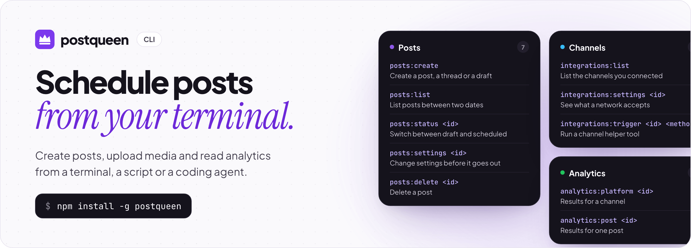
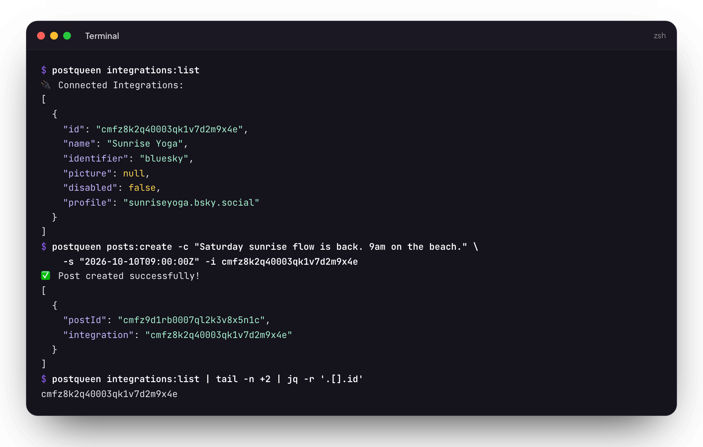

<p align="center">
  <picture>
    <source media="(prefers-color-scheme: dark)" srcset=".github/assets/banner-dark.png">
    
  </picture>
</p>

<p align="center">
  <code>postqueen</code> is the command line for PostQueen: schedule posts, upload media and read analytics from a terminal, a script or a coding agent.
</p>

<p align="center">
  <a href="https://postqueen.ai"><b>Website</b></a> ·
  <a href="https://docs.postqueen.ai/cli/introduction"><b>Docs</b></a> ·
  <a href="https://postqueen.ai/pricing"><b>Pricing</b></a> ·
  <a href="https://www.npmjs.com/package/postqueen"><b>npm</b></a>
</p>

<p align="center">
  <a href="https://www.npmjs.com/package/postqueen"></a>
  <a href="https://nodejs.org"></a>
  <a href="LICENSE"></a>
</p>

<p align="center">
  <a href="https://docs.postqueen.ai/agents/grok-bot"><picture><source media="(prefers-color-scheme: dark)" srcset="https://raw.githubusercontent.com/GkhanKINAY/postqueen-app/main/.github/assets/showcase/announce-dark.png"></picture></a>
</p>

<p align="center">
  <a href="https://app.postqueen.ai/auth?utm_source=github&utm_medium=readme&utm_campaign=postqueen-agent&utm_content=hero-button"><picture><source media="(prefers-color-scheme: dark)" srcset="https://raw.githubusercontent.com/GkhanKINAY/postqueen-app/main/.github/assets/showcase/btn-trial-dark.png"></picture></a><a href="https://docs.postqueen.ai/agents/overview"><picture><source media="(prefers-color-scheme: dark)" srcset="https://raw.githubusercontent.com/GkhanKINAY/postqueen-app/main/.github/assets/showcase/btn-agent-dark.png"></picture></a>
</p>

<p align="center">
  <sub><b>$0 due today.</b> A card is required, and you pay nothing if you cancel within 7 days.</sub>
</p>

<p align="center">
  <a href="https://github.com/GkhanKINAY/postqueen-agent/stargazers"><picture><source media="(prefers-color-scheme: dark)" srcset="https://raw.githubusercontent.com/GkhanKINAY/postqueen-app/main/.github/assets/showcase/star-dark.png"></picture></a>
</p>

<p align="center">
  <a href="https://docs.postqueen.ai/agents/overview"><picture><source media="(prefers-color-scheme: dark)" srcset="https://raw.githubusercontent.com/GkhanKINAY/postqueen-app/main/.github/assets/showcase/works-dark.png"></picture></a>
</p>




Posts you create with the CLI land on the same calendar you see in the PostQueen app.

## What it does

- Creates, lists, deletes and reschedules posts on the channels connected to your PostQueen workspace.
- Uploads images and videos and returns the path to use in a post.
- Reads channel analytics and post analytics.
- Shows each channel's settings schema and runs its helper tools, such as Reddit subreddit search or Pinterest boards.
- Ships a skill and plugins, so coding agents such as Claude Code, Cursor and Grok Build can run it for you.

## Quick start

You need Node.js 20.19 or newer (22.12 or newer on Node 22) and a PostQueen API key. In PostQueen, open Connections > API Keys to copy the key. Only workspace admins can see it, and each workspace has one.

```bash
npm install -g postqueen
export POSTQUEEN_API_KEY=your_api_key

postqueen integrations:list
postqueen posts:create -c "Hello from the terminal" -s "2026-12-31T12:00:00Z" -i "<integration-id>"
```

Some networks need settings of their own before they accept a post. X, for example, needs `who_can_reply_post`. Run `postqueen integrations:settings <integration-id>` to see what a channel needs, and pass it with `--settings '<json>'`.

No PostQueen account yet? [Start a 7-day trial, $0 due today](https://app.postqueen.ai/auth?utm_source=github&utm_medium=readme&utm_campaign=postqueen-agent&utm_content=quick-start).

## Commands

| Command | What it does |
| --- | --- |
| `posts:create` | Create a post: `-c` content (repeat it for a thread or comments), `-s` date, `-i` channel IDs, `-m` media paths, `-t draft` or `schedule`, `--settings`, or `--json <file>` for a full request body |
| `posts:list` | List posts between two dates (30 days back to 30 days ahead by default) |
| `posts:delete <id>` | Delete a post |
| `posts:status <id>` | Move a post between draft and scheduled |
| `posts:settings <id>` | Change the settings of a post that has not been published |
| `posts:missing <id>` | List recent content on the network for a post that has no release ID |
| `posts:connect <id>` | Connect a post to that content with `--release-id` |
| `integrations:list` | List the connected channels |
| `integrations:groups` | List customer groups |
| `integrations:settings <id>` | Show a channel's settings schema and helper tools |
| `integrations:trigger <id> <method>` | Run one of those helper tools, with `-d '<json>'` for its input |
| `analytics:platform <id>` | Channel analytics for the last 7 days, or `-d <days>` |
| `analytics:post <id>` | Analytics for one post |
| `upload <file>` | Upload an image or video and get its path |
| `auth:status` | Check which credentials the CLI uses and whether they work |
| `auth:login` | Say where to get the API key, and exit 1. With `--auth-server` or `POSTQUEEN_AUTH_SERVER`, log in through a device-flow auth server you run yourself |
| `auth:logout` | Remove the credentials `auth:login` stored |

Media goes in two steps: `upload` returns a `path`, and that path goes into `posts:create -m`. The [command reference](https://docs.postqueen.ai/cli/command-reference) has every flag.

### Output

Most commands print one human-readable status line and then the JSON result. Drop the first line before you parse it:

```bash
postqueen integrations:list | tail -n +2 | jq -r '.[].id'
```

`posts:missing` prints JSON only, and `posts:delete` prints only a confirmation line. When a command fails, the error goes to stderr and the command exits with code 1. `auth:status` prints its messages to stdout.

## Agent skill and plugins

The skill in [`skills/postqueen`](skills/postqueen/SKILL.md) teaches an agent to run the CLI. Every route below needs `POSTQUEEN_API_KEY` set where the agent runs, and every route except DeepSeek Harness also needs the CLI installed.

| Agent | Install |
| --- | --- |
| Any agent that reads the `skills` registry | `npx skills add GkhanKINAY/postqueen-agent` |
|  OpenClaw | `npm install -g postqueen`, `npx skills add GkhanKINAY/postqueen-agent`, then give OpenClaw the key as `POSTQUEEN_API_KEY` |
|  Claude Code | `/plugin marketplace add GkhanKINAY/postqueen-agent`, then `/plugin install postqueen@postqueen-agent` |
|  Cursor | Clone this repository and link it into `~/.cursor/plugins/local/postqueen` (manifest in [`.cursor-plugin`](.cursor-plugin/plugin.json)) |
|  Gemini CLI | `gemini extensions install https://github.com/GkhanKINAY/postqueen-agent` |
|  Grok Build | `grok plugin marketplace add GkhanKINAY/postqueen-agent`, then `grok plugin install postqueen --trust` |
| Qwen Code | `qwen extensions install GkhanKINAY/postqueen-agent:postqueen` |
| DeepSeek Harness | `dsh plugin --profile web add "github:GkhanKINAY/postqueen-agent#path:/plugins/dsh-postqueen"`. This one connects over MCP instead of the CLI; see [its README](plugins/dsh-postqueen/README.md) |

Prefer tool calls to shell commands? Many agents connect to PostQueen over MCP instead, by signing in or with the API key. See the [MCP guide](https://docs.postqueen.ai/mcp/introduction) and the [agents overview](https://docs.postqueen.ai/agents/overview).

## Configuration

| Variable | What it does |
| --- | --- |
| `POSTQUEEN_API_KEY` | Your workspace API key. Required on the hosted service. |
| `POSTQUEEN_API_URL` | The API the CLI calls. It defaults to `https://api.postqueen.ai`; set it to your own backend if you self-host. |
| `POSTQUEEN_AUTH_SERVER` | Not set by default. Set it, or pass `--auth-server`, to make `auth:login` log in through a device-flow auth server you run, such as the one in [`server/`](server/SERVER.md). The hosted service runs none, so use `POSTQUEEN_API_KEY` there. |

Stored `auth:login` credentials live in `~/.postqueen/credentials.json` and take priority over `POSTQUEEN_API_KEY`.

## Development

The CLI source is in [`src/`](src), in this repository.

```bash
pnpm install
pnpm run build     # bundles dist/index.js with tsup
pnpm run dev       # rebuilds on change
```

Publishing to npm uses `npm run publish:npm`, which swaps in [`NPM_README.md`](NPM_README.md) as the package page. See [PUBLISHING.md](PUBLISHING.md).

## Privacy and security

- Channels connect through each network's official OAuth sign-in where the network offers one.
- Some networks, such as Bluesky, Lemmy, WordPress and Nostr, need an app password, an account password or a key that you paste in.
- PostQueen stores these credentials so it can post for you, and replaces them when you remove the channel.
- Your API key gives full access to the workspace. Keep it in an environment variable, not in your code.
- Read the [privacy policy](https://postqueen.ai/privacy-policy), or [delete your account](https://postqueen.ai/delete-my-account).

**No PostQueen account yet?** The CLI posts through PostQueen Cloud: start a trial, copy the key from Connections > API Keys, and your terminal or coding agent can post.

<p align="center">
  <a href="https://app.postqueen.ai/auth?utm_source=github&utm_medium=readme&utm_campaign=postqueen-agent&utm_content=closing-band"><picture><source media="(prefers-color-scheme: dark)" srcset="https://raw.githubusercontent.com/GkhanKINAY/postqueen-app/main/.github/assets/showcase/cta-dark.png"></picture></a>
</p>

## Links

| | |
| --- | --- |
| CLI docs | [docs.postqueen.ai/cli/introduction](https://docs.postqueen.ai/cli/introduction) |
| npm | [`postqueen`](https://www.npmjs.com/package/postqueen) · [changelog](CHANGELOG.md) |
| API reference | [api.postqueen.ai/docs](https://api.postqueen.ai/docs) |
| Repositories | [app](https://github.com/GkhanKINAY/postqueen-app) · [CLI and skill](https://github.com/GkhanKINAY/postqueen-agent) · [n8n node](https://github.com/GkhanKINAY/postqueen-n8n) · [docs](https://github.com/GkhanKINAY/postqueen-docs) · [Docker Compose](https://github.com/GkhanKINAY/postqueen-docker-compose) · [Helm chart](https://github.com/GkhanKINAY/postqueen-helmchart) |
| Help | support@postqueen.ai · [GitHub issues](https://github.com/GkhanKINAY/postqueen-agent/issues) |

## License

The PostQueen CLI is open source under the [AGPL-3.0 license](LICENSE). PostQueen started as a fork of [Postiz](https://github.com/gitroomhq/postiz-app) by Nevo David, and this repository started from [postiz-agent](https://github.com/gitroomhq/postiz-agent).
